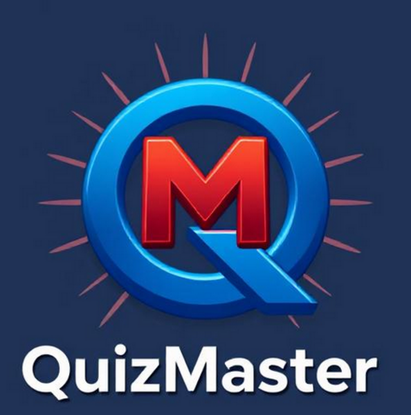

# Welcome to the World of QuizMaster!

Welcome to the QuizMaster World! We are a dedicated team of developers, educators, and quiz enthusiasts committed to creating the best open-source quiz platform and tools. We are using this organisation as a version for the public, while our main development is happening on [hermonochy's](https://github.com/hermonochy) account.

## Our Projects

### QuizMaster App

- [***QuizMaster App***](https://github.com/QuizMaster-world/QuizMaster) is our flagship project - a powerful and flexible quiz application that allows users to create, and play quizzes on various topics, in various ways! It features a user-friendly interface, real-time scoring, and customizable window themes.

- **Key Benefits**:
  - The richest in features (By far!).
  - Over 12 fun game modes.
  - User-friendly interface designed for seamless navigation.
  - Many extra "frills" to make it a more pleasing experience.
  - Customizable window themes that allow users to personalize their experience.
  - Quick Startup of QuizCreator.
  - Startup arguments supported to speed up navigation.

### QuizMasterLite 

- [***QuizMasterLite***](https://github.com/QuizMaster-world/QuizMasterLite) is a lighter version of the QuizMaster App, designed for users who need the core functionality of QuizMaster without the additional "frills" that increase size and complexity. By focusing on retaining the essential quiz creation and playing capabilities, QuizMasterLite ensures that users can still enjoy a seamless and engaging experience while benefiting from a significantly smaller application footprint.

- **Key Benefits:**
  - Compact and efficient, offering the essential quiz functionalities.
  - No extra "frilly" bits, which take up much of the proccessing power.
  - Maintains the same user-friendly GUI for a consistent experience.
  - Perfect for users who need a streamlined application with minimal storage requirements.

### QuizMasterMini

- [***QuizMasterMini***](https://github.com/QuizMaster-world/QuizMasterMini) is an even smaller version of QuizMaster with a GUI which less aesthetically pleasing than pygame but a lot smaller. As another lightweight alternative, QuizMasterMini is just 8 MB in size and comes with no dependencies (other than the Python standard library), ensuring accessibility for all!

- **Key Benefits**:
  - Only 8 MB in size, making it quick to download and install.
  - No additional dependencies required, simplifying installation.
  - Retains the most basic quiz functionalities, ensuring a satisfying user experience.

### QuizMasterTerminal

- [***QuizMasterTerminal***](https://github.com/QuizMaster-world/QuizMasterTerminal) uses a Terminal User Interface (TUI), allowing it to still deliver an efficient quizzing experience for users preferring command-line interactions or on systems where a graphical window is unavalible.

- **Key Benefits**:
  - Minimal size of just 1.4 MB.
  - Ideal for developers and users who prefer terminal interfaces.
  - Enables quick access to quizzes without the overhead of graphical components.
  
### MicroQuizMaster
- [***MicroQuizMaster***](https://github.com/QuizMaster-world/MicroQuizMaster) is our very smallest project, only ***8 KB*** big! Unlike QuizMasterTerminal, this version contains no example quizzes, does not even use a TUI interface and is the only MIT licenced repository. It targets users with the very weakest devices, **especially** Windows users or those seeking an experience with absolutely no frills.
- **Key Benefits**
  - Smallest avalible version of QuizMaster
  - No requirements
  - More permissive license

### QuizMasterPaper

- [***QuizMasterPaper***](https://github.com/QuizMaster-world/QuizMasterPaper) offers a printable version of quizzes that can be used in offline or classroom settings, given in either PDF or TXT form. While this project doesn't offer an interactive quiz game, the quiz creator can still utilize the JSON format found in our other repositories.

- **Features**:
  - Perfect for school teachers.
  - Allows quiz creators to use the JSON formats from our other repositories.

### QuizMaster-web

- **QuizMaster-web** is currently still in its early stages of development, but will soon become a web-app version of QuizMaster App.

## Contributing

We welcome contributions from the community! Whether you're a developer, designer, educator, or just someone passionate about quizzes, there are many ways you can help:

- **Code Contributions**: Check out our open issues and submit pull requests.
- **Additional Quizzes**: If you have expertise in a specific area, consider crafting a quiz and sharing it by creating a pull request.
- **Quiz Error Spotting**: Help us ensure the accuracy of our content. Run through existing quizzes and report any discrepancies or outdated information.
- **Bug Reports**: If you encounter any issues while using our applications, please let us know via issues. Your feedback helps us resolve bugs promptly.
- **Feature Requests**: Have an idea for a new feature? Let us know and we will take them into consideration!
- **Documentation**: Help us improve our documentation to help others start their quizzing journey with ease.
- **Adding QuizMasters**: Have your own quiz program and would like to see it put to use? Start a discussion and get your repository included in the world of QuizMaster!

## Community

Join our community to stay up-to-date with the latest news, updates, and discussions:

- **Discussions**: Participate in our [GitHub Discussions](https://github.com/orgs/QuizMaster-world/discussions) to share ideas and ask questions.

Your experience matters to us! If you have any questions, need help, or want to provide feedback, don’t hesitate to reach out:

- **GitHub Issues**: Use [issues](https://github.com/hermonochy/QuizMaster/issues) for reporting bugs or requesting features.
- **Discussions**: Engage with our community or seek assistance through [GitHub Discussions](https://github.com/orgs/QuizMaster-world/discussions).

Thank you for visiting QuizMaster! We hope you dive in and enjoy your quizzing journey. Happy quizzing! 🎉
